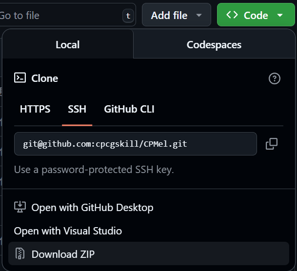
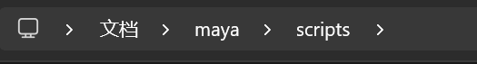

# cpform

CPForm is a declarative PyQt/PySide UI library designed to simplify PyQt/PySide interface development. It provides a declarative approach to create and manage user interfaces, making code more concise and maintainable.

<div style="display: flex; justify-content: space-between;">
  <div>
    <a href="./README.en-US.md">English</a> | <a href="./README.md">中文</a>
  </div>
</div>

## Table of Contents

- [Table of Contents](#table-of-contents)
  - [Features](#features)
  - [Quick Start](#quick-start)
    - [Installation](#installation)
    - [Testing](#testing)
  - [Usage Guide](#usage-guide)
    - [Native](#native)
    - [Maya](#maya)
    - [3ds Max](#3ds-max)
  - [Credits](#credits)
  - [License](#license)

### Features

1. Support for both Python 2 and Python 3
2. Declarative coding style
3. Simple usage logic
4. Easy integration with PyQt and PySide

### Quick Start

#### Installation

- CPForm is not yet published to PyPI, but you can install it from source code by following these steps:

```bash
git clone git@github.com:cpcgskill/cpform.git
cd cpform
```

- Or download the source code archive directly from GitHub and extract it.



#### Testing

CPForm provides a simple test script that can be run with the following command:

```bash
python3 ./scripts/cpform_test/core.py # python3 may need to be replaced with your own Python path
```

### Usage Guide

#### Native

Here we use PySide2+Python3 as an example. Other versions of PyQt/PySide have similar usage.

```python
from PySide2.QtWidgets import *
import sys

app = QApplication(sys.argv)

from cpform.widget.core import *
import cpform.docker as docker


def show():
    ui = ScrollArea(
        VBoxLayout(
            childs=[
                Label('Label'),
                PrimaryButton(text='PrimaryButton'),
                AttentionButton(text='AttentionButton'),
                SuccessButton(text='SuccessButton'),
                WarningButton(text='WarningButton'),
                ErrorButton(text='ErrorButton'),
                NormalButton(text='Button'),
            ],
            align='top'
        )
    )
    docker.default_docker(title='Native Example', form=ui)


show()
app.exec_()
```

#### Maya

CPForm usage in Maya is similar to Native, but you don't need to create a QApplication instance when launching in Maya. You can run the following code directly in Maya's Python Script Editor:

```python
from cpform.widget.core import *
import cpform.docker as docker


def show():
    ui = ScrollArea(
        VBoxLayout(
            childs=[
                Label('Label'),
                PrimaryButton(text='PrimaryButton'),
                AttentionButton(text='AttentionButton'),
                SuccessButton(text='SuccessButton'),
                WarningButton(text='WarningButton'),
                ErrorButton(text='ErrorButton'),
                NormalButton(text='Button'),
            ],
            align='top'
        )
    )
    docker.default_docker(title='Maya Example', form=ui)


show()
```

- Note: When using CPForm in Maya, please ensure that the src directory under CPForm has been added to Maya's Python path.
- Alternatively, copy all files under src to Maya's Python scripts directory.
  

#### 3ds Max

***todo***, CPForm will automatically handle code compatibility, so usage in 3ds Max is similar to Maya. You just need to make sure to add it to 3ds Max's Python path.

### Credits

- Icons source: https://github.com/feathericons/feather

### License

This project is licensed under Apache-2.0. For details, see LICENSE