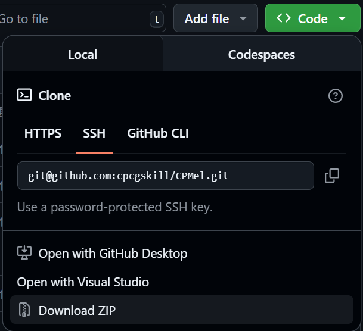
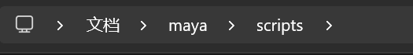

# cpfrom

CPForm 是一个声明式的 PyQt/PySide 界面库，旨在简化 PyQt/PySide 的界面开发。它提供了一种声明式的方式来创建和管理用户界面，使得代码更加简洁和易于维护。

## 目录

- [功能介绍](#功能介绍)
- [快速开始](#快速开始)
    * [安装](#安装)
    * [测试](#测试)
- [使用教程](#使用教程)
    - [Maya](#Maya)
    - [3ds Max](#3ds-Max)
    - [Native](#Native)
- [版权说明](#版权说明)

### 功能介绍

1. 支持python2和python3
2. 声明式的代码风格
3. 简单的使用逻辑
4. 容易与PyQt和PySide交互

### 快速开始

#### 安装

- CPForm 目前尚未发布到 PyPI，但你可以通过以下步骤从源代码安装：

```bash
git clone git@github.com:cpcgskill/CPMel.git
cd CPMel
```

- 或者直接从 GitHub 下载源代码压缩包并解压。



#### 测试

CPForm 提供了一个简单的测试脚本，可以通过以下命令运行：

```bash
python3 ./scripts/cpform_test/core.py # python3 可能需要替换为你自己的 Python 路径
```

### 使用教程

#### Native

这里以PySide2+Python3为例，其他版本的PyQt/PySide使用方法类似。

```python
from PySide2.QtWidgets import *
import sys

app = QApplication(sys.argv)

from cpform.widget.core import *
import cpform.docker as docker


def show():
    ui = ScrollArea(
        VBoxLayout(
            childs=[
                Label('Label'),
                PrimaryButton(text='PrimaryButton'),
                AttentionButton(text='AttentionButton'),
                SuccessButton(text='SuccessButton'),
                WarningButton(text='WarningButton'),
                ErrorButton(text='ErrorButton'),
                NormalButton(text='Button'),
            ],
            align='top'
        )
    )
    docker.default_docker(title='Native Example', form=ui)


show()
app.exec_()
```

#### Maya

CPForm 在 Maya 中的使用方法与 Native 类似，但在maya中启动时无需创建 QApplication 实例。你可以直接在 Maya 的 Python
脚本编辑器中运行以下代码：

```python
from cpform.widget.core import *
import cpform.docker as docker


def show():
    ui = ScrollArea(
        VBoxLayout(
            childs=[
                Label('Label'),
                PrimaryButton(text='PrimaryButton'),
                AttentionButton(text='AttentionButton'),
                SuccessButton(text='SuccessButton'),
                WarningButton(text='WarningButton'),
                ErrorButton(text='ErrorButton'),
                NormalButton(text='Button'),
            ],
            align='top'
        )
    )
    docker.default_docker(title='Maya Example', form=ui)


show()
```

- 注意：在 Maya 中使用 CPForm 时，请确保CPForm下的src目录已添加到 Maya 的 Python 路径中。
- 或者将src下的所有文件复制到 Maya 的 Python 脚本目录中。
  

#### 3ds-Max

***todo***, CPForm 会自动完成代码的兼容，所以在 3ds Max 中的使用方法与 Maya 类似。只需要注意将其添加到 3ds Max 的 Python
路径中即可。

### 版权说明

该项目签署了Apache-2.0 授权许可，详情请参阅 LICENSE


